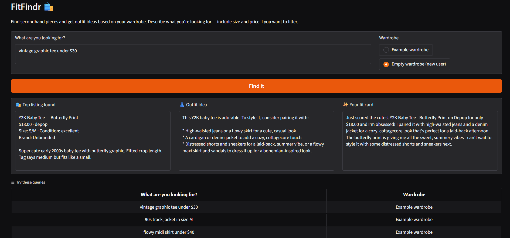

# FitFindr — Starter Kit

This starter kit contains everything you need to begin Project 2.

## What's Included

```
ai201-project2-fitfindr-starter/
├── data/
│   ├── listings.json          # 40 mock secondhand listings
│   └── wardrobe_schema.json   # Wardrobe format + example wardrobe
├── utils/
│   └── data_loader.py         # Helper functions for loading the data
├── planning.md                # Your planning template — fill this out first
└── requirements.txt           # Python dependencies
```

## Setup

```bash
pip install -r requirements.txt
```

Set your Groq API key in a `.env` file (get a free key at [console.groq.com](https://console.groq.com)):
```
GROQ_API_KEY=your_key_here
```

## The Mock Listings Dataset

`data/listings.json` contains 40 mock secondhand listings across categories (tops, bottoms, outerwear, shoes, accessories) and styles (vintage, y2k, grunge, cottagecore, streetwear, and more).

Each listing has: `id`, `title`, `description`, `category`, `style_tags`, `size`, `condition`, `price`, `colors`, `brand`, and `platform`.

Load it with:
```python
from utils.data_loader import load_listings
listings = load_listings()
```

## The Wardrobe Schema

`data/wardrobe_schema.json` defines the format your agent uses to represent a user's existing wardrobe. It includes:

- `schema`: field definitions for a wardrobe item
- `example_wardrobe`: a sample wardrobe with 10 items you can use for testing
- `empty_wardrobe`: a starting template for a new user

Load an example wardrobe with:
```python
from utils.data_loader import get_example_wardrobe
wardrobe = get_example_wardrobe()
```

## Where to Start

1. **Read `planning.md` and fill it out before writing any code.**
2. Verify the data loads correctly by running `python utils/data_loader.py`.
3. Build and test each tool individually before connecting them through your planning loop.

Your implementation files go in this same directory. There's no required file structure for your agent code — organize it however makes sense for your design.

## Tools

List every tool your agent will use. For each tool, fill in all four fields.
You must have at least 3 tools. The three required tools are listed — add any additional tools below them.

### Tool 1: search_listings

**What it does:**
<!-- Describe what this tool does in 1–2 sentences -->
The tool loads all the listings using load_listings(). 
The input to the tool are all the details of what the user is looking for like the item's description, size, and max_price. The tool searches the listings for any items that matches what the user is looking for. 

**Input parameters:**
<!-- List each parameter, its type, and what it represents -->
- `description` (str): keywords the describe what the user is looking for
- `size` (str): size of item they're looking for, or None if they don't want to specify a size
- `max_price` (float): the maximum price they want the item to be, or None if they don't want to filter by price

**What it returns:**
<!-- Describe the return value — what fields does a result contain? -->
It returns a list of matching listing dicts, sorted by relevance score (highest first), and an empty list if there are no matches.

**What happens if it fails or returns nothing:**
<!-- What should the agent do if no listings match? -->
It returns an empty list. The agent sets session["error"] and returns early, and doesn't call suggest_outfit() with no item.

---

### Tool 2: suggest_outfit

**What it does:**
<!-- Describe what this tool does in 1–2 sentences -->
It checks whether the wardrobe is empty. If it is, it calls the LLM and prompts it to provide general styling tips. If it's non-empty, it provides the LLM with the wardrobe items as a prompt, and requests outfit suggestions using the new item and the existing items in the wardrobe.

**Input parameters:**
<!-- List each parameter, its type, and what it represents -->
- `new_item` (dict): the item the user is thinking of buying
- `wardrobe` (dict): the user's wardrobe, with an 'items' key holding a list of their clothing item dicts, and it can be empty

**What it returns:**
<!-- Describe the return value -->
It returns a string with outfit suggestions provided by the LLM. If the user's wardrobe happens to be empty, general styling tips are provided by the LLM.

**What happens if it fails or returns nothing:**
<!-- What should the agent do if the wardrobe is empty or no outfit can be suggested? -->
It never raises or returns an empty string. If the wardrobe is empty, it falls back to general styling tips instead of specific outfit ideas, so the agent always gets a usable string to pass to create_fit_card().

---

### Tool 3: create_fit_card

**What it does:**
<!-- Describe what this tool does in 1–2 sentences -->
It takes the outfit suggestion and the new item and prompts the LLM to write a short, shareable caption for the find. The caption mentions the item's name, price, and platform.

**Input parameters:**
<!-- List each parameter, its type, and what it represents -->
- `outfit` (str): the outfit suggestion string returned by suggest_outfit()
- `new_item` (dict): the listing dict for the thrifted item, used for the name, price, and platform

**What it returns:**
<!-- Describe the return value -->
It returns a 2–4 sentence caption string, ready to use as an Instagram/TikTok post.

**What happens if it fails or returns nothing:**
<!-- What should the agent do if the outfit data is incomplete? -->
If the outfit string is empty or whitespace-only, it returns a descriptive error message string instead of raising an exception.

---

## Planning Loop

**How does your agent decide which tool to call next?**
<!-- Describe the logic your planning loop uses. What does it look at? What conditions change its behavior? How does it know when it's done? -->

First it extracts a description, size, and max_price from the raw query and stores them in session["parsed"]. It calls search_listings() and stores the result in session["search_results"]. It then checks if session["search_results"] is empty. If it is, it sets session["error"] and returns early. If it's not empty, it sets session["selected_item"] to be the first item (most highly scored item) from session["search_results"]. 

It then calls suggest_outfit() and stores the result in session["outfit_suggestion"]. If the user's wardrobe is empty, it prompts the LLM to provide general styling advice. If it's not empty, the LLM provides outfit suggestions.

The agent then calls create_fit_card() and stores the result in session["fit_card"]. This tool creates a short caption that the user can use to create a post on social media. If there is no outfit suggested from suggest_outfit(), it returns a descriptive error message.

The loop ends and returns the session once fit_card is set (success) or as soon as session["error"] is set (early exit). The caller decides what to show by checking session["error"] first.

## State Management

**How does information from one tool get passed to the next?**
<!-- Describe how your agent stores and accesses state within a session. What data is tracked? How is it passed between tool calls? -->
All state lives in a single session dict created at the start of the run. The tools don't talk to each other directly, and each step writes its output into the session, and the next step reads that from there. The flow is: parsed query → search_results → first item from selected_item → outfit_suggestion → fit_card, with error set if the run stops early. Because everything is in one dict, the final session is also what gets returned to the caller.

## Error Handling

For each tool, describe the specific failure mode you're handling and what the agent does in response.

| Tool | Failure mode | Agent response |
|------|-------------|----------------|
| search_listings | No results match the query |Returns an empty list and ends early|
| suggest_outfit | Wardrobe is empty |Prompts LLM to provide general styling tips |
| create_fit_card | Outfit input is missing or incomplete |Returns a descriptive error message string |

suggest_outfit fail: 


## Spec Reflection

**One way the spec helped:** Filling in the "What happens if it fails or returns nothing" field for every tool before writing code settled the error contract up front. Because each tool's failure mode was already decided (search returns `[]`, suggest_outfit always returns a usable string, create_fit_card returns an error string), the planning loop in `run_agent()` fell out almost directly from the spec — the only branch I had to write was the early exit that sets `session["error"]` when `search_results` is empty. 

**One way implementation diverged:** The spec described query parsing as simply "extract a description, size, and max_price," and the Complete Interaction example assumed `"vintage graphic tee under $30"` cleanly produces `description = "vintage graphic tee"`. In practice the example queries also contain styling preferences and questions ("I mostly wear baggy jeans... how would I style it?"), and a naive keyword split fed all of that into `search_listings`, polluting the relevance score with wardrobe words. So `_parse_query()` grew beyond the spec: a `_STOP_MARKER` regex that cuts the description at the first styling/question phrase, plus a `_FILLER` stop-word set. This wasn't in planning.md because the problem only surfaced once I ran the spec's own example query against the search tool.

## AI usage 

**Instance 1 — Implementing the three tools (Milestone 3):** I gave Claude the Tools section of planning.md (inputs, return values, failure modes) plus the TODO stubs in `tools.py` and asked it to implement each function. I overrode two of its choices: (1) its first `search_listings` only matched keywords against the title and description, so I directed it to also fold `style_tags`, `colors`, `category`, and `brand` into the searchable text — otherwise a query like "y2k" matched nothing despite tagged listings; (2) it used one default temperature for both LLM tools, and I split them — `0.7` for `suggest_outfit` (consistent, wearable advice) and `1.0` for `create_fit_card` (captions should read differently each run), matching the "sound different each time" guideline.

**Instance 2 — Implementing the planning loop (Milestone 4):** I gave Claude the Planning Loop, State Management, and Error Handling sections plus the `run_agent()` and `_new_session()` stubs in `agent.py`. Its initial query parser split the raw string on whitespace and passed everything to `search_listings`, which dragged styling/wardrobe words into the search and skewed results. I revised it to add the `_STOP_MARKER` regex and `_FILLER` set so only the item-description clause survives, and I kept parsing deterministic (regex, no LLM call) rather than the LLM-parsing option Claude suggested.


## Demo Link

https://www.loom.com/share/e363580a5e69473aae06a529a4c7442f
